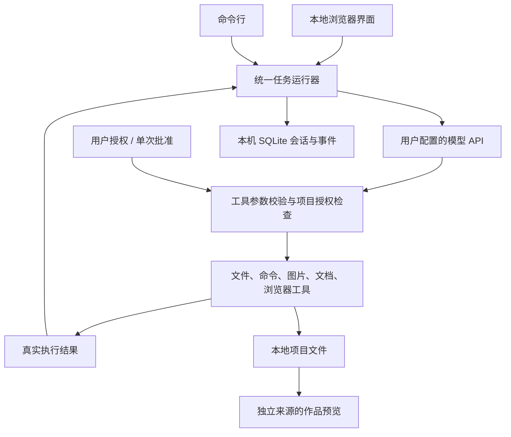

# LebotClaw Harness

**面向青少年创作场景的开源本地智能体架构，和「超级小博」一起把想法做成真实作品。**

连接自己的模型 API，在浏览器里说出需求，超级小博就可以在获得授权后读取本地材料、编写和修改代码、生成图片、制作网页与游戏、输出可编辑的 PPT 和 Word 文档，并调用工具检查结果。作品保存在你自己的电脑上，可以继续修改、运行和分享。

**当前版本：v0.2.1 · 开发预览版**

[快速开始](#quick-start) · [第一次使用](#first-project) · [模型配置](#models) · [常见问题](#faq) · [开发文档](#development) · [MIT License](LICENSE) · [CI 检查](https://github.com/bushushu2333/LebotClaw-Harness/actions/workflows/test.yml)

## 这是什么

**LebotClaw** 是 LebotWorld 中的云端超级智能体功能；**LebotClaw Harness** 则把智能体的任务执行能力带到用户自己的电脑上，通过本地服务提供浏览器界面，处理用户授权的本地项目和文件。

它面向的需求不局限于某一种游戏或固定模板。例如：

- 孩子说：“做一个能编辑、保存和导出的动态课程表。”
- 孩子说：“把田忌赛马做成一个可以选择出场顺序的游戏。”
- 老师说：“根据这些材料，帮我写课程设计，再做一份可以编辑的 PPT。”
- 用户说：“读一下这个项目，修复网页上的按钮问题，并实际打开页面检查。”
- 用户说：“分析这张试卷照片，整理错题和需要复习的知识点。”
- 创作者说：“整理我的小说大纲，分章节保存，再为故事生成一张封面。”

Harness 负责组织“理解需求 → 调用工具 → 检查结果 → 修复与继续”的过程。模型负责推理和生成内容，工具负责真正读写文件、制作素材和执行检查。**对话里说完成了，并不等于任务完成；应当打开实际文件和作品验收。**

### 使用形态

- **本地服务 + 浏览器界面**：启动后访问 `http://127.0.0.1:18866/`，无需安装独立桌面窗口程序。
- **优先支持自带 API Key**：可以使用模型厂商官方 Key，也可以使用兼容协议的中转站 Key，无需 LebotWorld 账号。
- **LebotAPI 是可选接入方式**：不熟悉购买模型 API 的用户，可使用个人 LebotAPI Key 和乐豆额度；国内主流模型的价格规则为官方价 **95 折**。
- **角色是超级小博**：围绕用户的真实任务工作，通过对话持续修改同一个项目。
- **源码开放、作品在本机**：可以检查、修改和扩展运行逻辑，也可以直接用其他编辑器处理生成的文件。

“本地运行”指界面服务、任务运行器、文件工具与项目存储在本机。使用在线模型时，对话、所选材料和相关工具结果仍会发送给配置的服务商；本项目不会自动下载或部署本地大模型。

当前是开发预览版，适合开发者、家长及学校技术人员安装试用和验证。已完成的能力、真实验收情况与后续工作见下文。

## 目录

1. [当前可以做什么](#capabilities)
2. [安装与启动](#quick-start)
3. [第一次使用：从需求到作品](#first-project)
4. [模型与 API Key 配置](#models)
5. [图片生成、语音和文档](#media)
6. [授权模式与任务预算](#permissions)
7. [命令执行与 Docker](#execution)
8. [CLI 使用](#cli)
9. [文件保存、备份与升级](#storage)
10. [常见问题](#faq)
11. [技术架构与开发](#development)
12. [验证记录与后续计划](#validation)

<a id="capabilities"></a>
## 1. 当前可以做什么

| 能力 | 当前实现 | 使用条件或说明 |
| --- | --- | --- |
| 本地文件处理 | 列出、读取、搜索、创建和修改项目文件；精确文本替换；覆盖前检查内容哈希并保留旧版本 | 需要相应项目读写授权 |
| 网页与游戏 | 生成 HTML、CSS、JavaScript 和图片等多文件作品，在浏览器中预览和运行 | 适合先从浏览器可运行的项目开始；复杂工程依赖额外运行环境 |
| 修改已有代码 | 选择已有项目，读取相关代码，修改文件，并按条件执行检查 | 构建、运行测试等命令需要另行授权 |
| 浏览器交互检查 | 用 Chromium 点击、填写、检查页面文字、刷新和检查下载，收集脚本及资源错误，保存截图 | 安装浏览器扩展依赖；只检查本项目，不是通用上网浏览工具 |
| 图片素材 | 调用配置的生图 API，把真实图片保存到项目，再用于网页、游戏或文档 | 独立配置生图服务，并授权调用 |
| PPT / Word | 生成可编辑的 `.pptx`、`.docx`，组织页面或章节，插入项目图片 | 安装文档扩展依赖；目前是标准内容布局，未实现 Office 渲染后的自动视觉修正 |
| 材料阅读 | 提取 PDF 文本层、Word 和 PPT 中的文字，读取文本材料 | 扫描 PDF 没有文本层时，当前不能直接 OCR |
| 试卷照片分析 | 把照片交给支持图片输入的文字模型分析，继续整理学习材料 | 模型本身必须支持视觉；分析质量取决于模型和照片清晰度 |
| 写作与课程设计 | 整理大纲、撰写和修改内容，保存为项目文件或文档 | 需要文字模型；写入文件时需要授权 |
| 语音输入 / 播报 | 录音转文字后由用户确认发送；调用 TTS 播报回复 | 独立配置兼容的 ASR / TTS 服务 |
| 持续对话与记录 | 保存项目会话、工具操作和运行结果，可继续已有任务 | 长上下文压缩尚未实现，特别长的任务可能需要新建对话 |
| 本地工具扩展 | 注册受信任的 Python 工具插件 | 开发者能力；插件具有宿主 Python 进程权限 |

**生成能力不等于任意任务都能一次成功。** 模型的工具调用能力、任务复杂度、可用材料、依赖和授权都会影响结果。可以要求超级小博根据实际错误继续修复；复杂游戏、工程构建和桌面应用打包需要逐项验收。

<a id="quick-start"></a>
## 2. 安装与启动

### 2.1 准备环境

| 项目 | 要求 |
| --- | --- |
| Python | 3.9 或以上，建议 3.12；终端中的 `python3 --version` 或 `py -3 --version` 应能输出版本 |
| Git | 用于克隆和更新本仓库 |
| 浏览器 | 用于访问本地界面 |
| 模型服务 | 至少一个支持 OpenAI Chat Completions 和工具调用的文字模型及可用 Key |
| 网络 | 安装依赖、调用在线模型时需要 |
| Docker | 可选；仅在需要隔离执行系统命令时使用 |
| GPU / Node.js | Harness 本身不要求 GPU 或 Node.js；具体生成项目可能需要额外工具 |

本版本已在 macOS 本机验证，CI 覆盖 macOS/Linux 的 Python 3.9 和 3.12。下面提供 Windows 安装命令，但当前未完成 Windows 整机验收。

### 2.2 macOS / Linux

打开终端，逐行执行：

```sh
git clone https://github.com/bushushu2333/LebotClaw-Harness.git
cd LebotClaw-Harness

python3 -m venv .venv
source .venv/bin/activate

python -m pip install --upgrade pip
python -m pip install -e '.[documents,browser,secure-keys]'
python -m playwright install chromium

lebotclaw web --open
```

安装选项的含义：

- `documents`：读取 PDF / Office 文档，生成 PPTX / DOCX。**自 v0.3 起已并入默认安装**，无需单独指定（保留别名仅为兼容旧命令）。
- `browser`：安装 Playwright，用于检查生成的网页；还需要执行上面的 Chromium 安装命令。体积较大，仍为可选项。
- `secure-keys`：允许把 Key 保存到受支持的系统凭据库。**自 v0.3 起已并入默认安装**，无需单独指定（保留别名仅为兼容旧命令）。

`browser` 是推荐安装项，可以支持下面的完整使用流程。Linux 如提示缺少 Chromium 系统库，可使用 `python -m playwright install --with-deps chromium` 安装所需系统依赖，可能需要系统管理员权限。

### 2.3 Windows PowerShell

```powershell
git clone https://github.com/bushushu2333/LebotClaw-Harness.git
cd LebotClaw-Harness

py -3 -m venv .venv
.\.venv\Scripts\python.exe -m pip install --upgrade pip
.\.venv\Scripts\python.exe -m pip install -e ".[documents,browser,secure-keys]"
.\.venv\Scripts\python.exe -m playwright install chromium

.\.venv\Scripts\python.exe -m lebotclaw_harness web --open
```

上述方式直接使用虚拟环境里的 Python，无需运行激活脚本。若系统没有 `py` 启动器，可用已安装的 Python 3 对应命令创建虚拟环境。

Windows 如需运行项目命令，请使用 Docker；当前本机命令的完整进程树停止只在 macOS/Linux 路径验证。

### 2.4 打开界面与再次启动

默认地址为：

```text
http://127.0.0.1:18866/
```

`--open` 会尝试在默认浏览器中打开。如果没有自动打开，把上面的地址粘贴到浏览器即可。**终端需要保持运行**：关闭浏览器标签页不会停止服务；在启动终端按 `Ctrl + C` 才会停止服务。

以后使用时，不需要重新安装。在仓库目录执行：

```sh
# macOS / Linux
source .venv/bin/activate
lebotclaw web --open
```

Windows 再次执行安装步骤最后一条启动命令即可。

仓库也提供 `scripts/start.sh` 和 `scripts/start.ps1` 作为启动辅助脚本。它们在虚拟环境不存在时完成首次安装，之后直接启动；已有虚拟环境的依赖更新仍需按[升级步骤](#upgrade)执行。

如果默认端口被占用，可以改用其他端口：

```sh
lebotclaw web --port 18868 --open
```

此时访问 `http://127.0.0.1:18868/`。端口号以实际启动参数为准。

服务只监听本机地址。当前安装方式是从源码运行，不提供已签名的 DMG / EXE 安装包，也不要求从 PyPI 安装同名包。

<a id="first-project"></a>
## 3. 第一次使用：从需求到作品

v0.3 起界面分为两种模式，顶栏中央的「💬 聊天 ｜ 🛠️ 制作」随时切换：

- **聊天模式（默认）**：打开即聊，不需要项目。问问题、拍照问试卷、讨论想法都在这里；对话不保存任何文件，也不需要授权。聊到想做的内容，点输入框上方浮出的「🛠️ 开始制作 →」，会带着聊天要点创建项目。
- **制作模式**：有明确的项目文件夹，文件、预览和授权都在这里。新项目默认仍是 Plan（先讨论规划），正式制作前单独授权。

使用顺序是：

**连接模型 → （聊天讨论，可选）→ 开始制作/选择项目 → 描述需求 → 确认方案 → 授权制作 → 检查并打开作品。**

### 第一步：连接一个文字与编程模型

首次打开界面，在「连接你的模型」中：

1. 选择「文字与编程」。
2. 选择模型来源，填写服务商给出的准确模型 ID、API 地址和 API Key。
3. 根据需要选择是否保存 Key。
4. 点击「保存并测试连接」。
5. 普通对话和工具调用检查通过后，点击「继续 → 选择项目」。

不必一开始就配齐图片和语音。先连通一个文字模型，即可开始制作普通网页、游戏和文档。具体字段见[模型配置](#models)。

### 第二步：选择文件保存在什么地方

在「开始一个项目」中填写项目名称，例如「我的田忌赛马」。

保存位置有两种选择：

- **新建一个独立的本地项目文件夹**：由 Harness 在数据目录下创建，适合第一次使用。
- **使用已有文件夹**：输入路径或浏览本机文件夹，适合修改已有代码、读取已有材料。

选择项目只是在确定工作位置，**不会自动授权模型读取或修改这个目录**。

### 第三步：先把需求讲清楚

新项目默认是 **Plan**，可以先讨论方案。下面是一个可直接粘贴的需求示例：

```text
我想做一个田忌赛马小游戏，中文界面。
我可以选择上、中、下三匹马的出场顺序，和齐王比赛三轮。
请显示每轮结果、总比分，并解释不同出场顺序为什么会赢或输。
游戏要有开始、重新开始按钮，能在浏览器中直接玩。
先告诉我准备怎么做，以及需要我确认什么。
```

如果已配置生图，可以补充：

```text
请用我配置的生图模型生成赛马场景素材，保存到项目里并用到游戏中。
```

也可以先做不依赖生图的版本，再通过后续对话添加图片。没有配置生图服务时，文字模型不会凭空获得图片生成 API。

### 第四步：授权并开始制作

方案确认后，点击「授权并继续」。界面会展示本次允许的操作。

第一次制作普通网页游戏，可以这样设置：

| 设置 | 建议选择 |
| --- | --- |
| 如何批准操作 | 自动执行 |
| 查看本项目文件 | 开启 |
| 创建和修改项目文件，打开浏览器检查作品 | 开启 |
| 调用已配置的生图服务制作素材 | 需要图片时开启 |
| 运行命令和安装依赖 | 普通 HTML 游戏可以先不开启 |
| 授权后，继续刚才的需求 | 开启 |

点击「授权并开始制作」后，超级小博才会执行。自动模式下，生图请求仍会显示批准卡片；查看生成描述和文件位置后批准或拒绝即可。

如果只想看计划，继续使用 Plan；如果希望授权范围内不再弹出批准卡片，可明确选择「不需要批准」。详见[授权模式](#permissions)。

### 第五步：观察制作与检查

对话中会显示回复和当前操作，详细日志可以展开查看。正常过程可能包含：

```text
查看项目 → 生成素材 → 写入 HTML / CSS / JS
→ 在 Chromium 中打开 → 检查交互 → 修复错误 → 再次检查
```

模型需要根据实际结果决定下一步，并非每次任务都固定经过全部步骤。出现错误时，界面会展示原因及重试或模型配置入口；原先已经生成的文件仍然保留。

可以继续要求：

> 请实际检查开始游戏、三轮结算、重新开始和全部出场顺序，不要只确认页面能打开。

### 第六步：打开、下载和继续修改

出现成果后，展开「项目文件」：

- 选择 `index.html` 可以预览网页，点击「打开作品」可在新标签页运行。
- 「查看源文件」用于查看 HTML 源码；其他文本文件可以直接查看。
- 「下载」保存当前文件；PPTX / DOCX 下载后可用相应办公软件打开。
- 「下载项目」导出项目 ZIP，适合一起保存 HTML、脚本、样式和图片。
- 「在文件管理器中打开」直接定位本机项目目录。

**多文件作品应保留原来的目录结构。** 如果游戏引用了 `assets/horse.png`，只下载 `index.html` 会丢失图片，应下载项目 ZIP 后解压。是否能直接双击 HTML 运行取决于作品代码；依赖模块加载或本地服务的项目，使用 Harness 预览或项目说明中的启动方式。

继续在同一个对话中说“把速度调慢一点”“加一个解释策略的页面”即可迭代。临时制作授权用完会回到 Plan，需要再次授权后才能修改文件。

### 其他可以尝试的需求

| 场景 | 示例 |
| --- | --- |
| 动态课程表 | “做一个五天六节课的课程表，可以修改课程和教室，刷新后保留数据，并能导出 JSON。请验证保存和导出。” |
| 课程设计与 PPT | “阅读项目里的课程材料，面向五年级写一份 40 分钟课程设计，再生成六页可编辑 PPT，包含活动步骤和课堂提问。” |
| 试卷分析 | “分析这张试卷照片，把看清的错题按知识点整理，解释错误原因，并给出两道同类练习；看不清的地方先问我。” |
| 小说创作 | “根据这个大纲整理人物和章节关系，先写第一章，保存在项目里，后续逐章修改。” |
| 网页计时器 | “做一个学习计时器，可以开始、暂停和重置，在页面保持打开时到点提醒。” |

网页计时器不等于操作系统闹钟：关闭页面、电脑休眠后的常驻提醒，需要额外的系统集成，当前没有内置调度服务。

<a id="models"></a>
## 4. 模型与 API Key 配置

### 4.1 可以接哪些模型

当前文字接口支持 **OpenAI Chat Completions 兼容协议**，包括 SSE 流式返回和工具调用。

| 模型来源 | 如何选择 | API 基础地址 |
| --- | --- | --- |
| DeepSeek | 选择「DeepSeek」 | 内置 `https://api.deepseek.com/v1` |
| GLM / 智谱 | 选择「GLM / 智谱」 | 内置 `https://open.bigmodel.cn/api/paas/v4` |
| Kimi、Qwen 等其他厂商 | 选择「其他官方 / 中转站 / LebotAPI」 | 填写该账户可用的 OpenAI 兼容基础地址 |
| 第三方中转站 | 同上 | 填写中转站提供的兼容基础地址 |
| LebotAPI | 同上 | 填写 LebotAPI 提供的基础地址和个人 Key |
| 本机模型服务 | 同上 | 可填写本机 HTTP 兼容地址；模型服务需用户自行部署 |

以上是**接入方式**，不代表所有厂商的专有协议、套餐、全部型号都已经适配或实测。模型 ID 必须填写账户实际可用的准确名称，不能用“最新模型”等自然语言代替。

一个 Key 可以访问哪些模型，由服务商决定。仅能聊天但不支持工具调用的模型，不能完成文件操作等智能体任务。

### 4.2 配置字段怎么填

| 字段 | 填写说明 |
| --- | --- |
| 模型来源 | 选择对应厂商，或选择兼容接口 |
| 模型名称 / ID | 服务商提供的精确模型标识 |
| OpenAI 兼容 API 地址 | 填基础地址，程序会追加 `/chat/completions`；不要填写厂商官网、控制台页面或完整聊天接口路径 |
| API Key | 填该服务的 Key；已有密钥时留空表示保留 |
| 保存到系统凭据库 | 勾选后，尝试安全持久保存；未勾选的新 Key 仅保留在当前服务进程中 |
| 此模型支持图片输入 | 仅对真正具备视觉能力的模型开启，用于试卷照片等图片材料 |
| 密钥环境变量名称 | 可选，例如 `DEEPSEEK_API_KEY`；填写变量名，不是 Key 的值 |
| 单次最大输出 token | 默认 8192，必须在服务商和模型支持范围内 |
| 推理强度 | 默认使用模型默认值；仅在服务商支持该参数时调整 |

**特别注意 API 协议。** 当前不能把 Anthropic Messages 地址当作 Chat Completions 地址使用。例如 GLM 的 `/api/anthropic` 地址不适用于这里的文字接口；应使用表格中的兼容地址。接口格式错误时，换 Key 并不能解决问题。

点击「保存并测试连接」会发起普通对话和工具调用检查，可能产生少量模型用量。检查通过表示基础协议可用，不等于该模型能够完成任何复杂任务。

已有正常回复的会话会绑定模型和提供商。需要换模型时，请新建对话，仍可选择原项目文件夹继续处理文件。

### 4.3 Key 如何保存

| 方式 | 重启后是否保留 | 说明 |
| --- | --- | --- |
| 当前进程内存 | 否 | 适合临时试用，关闭本地服务后需要重新输入 |
| 环境变量 | 取决于启动环境 | 启动服务的进程必须能读取该变量；在另一个终端设置不一定会生效 |
| 系统凭据库 | 是，前提是系统凭据后端可用 | 在界面勾选保存即可（keyring 已随默认安装提供） |

普通 `config.json` 保存模型地址、型号和能力绑定，不保存明文 Key。系统凭据库不可用时会报错，不会静默退回明文文件。已保存凭据绑定配置及接口目标，修改服务商或地址后需要重新确认凭据。

### 4.4 使用 LebotAPI 和乐豆

自带官方或第三方 Key 是完整的一等接入方式，**使用 Harness 不要求购买 LebotAPI，也不要求注册 LebotWorld**。

选择 LebotAPI 的用户，产品流程是：

1. 在 LebotWorld 资源中心的 LebotAPI 平台管理乐豆与个人 Key。
2. 设置这个 Key 可以使用的乐豆额度。
3. 取得 API 基础地址、个人 Key 和可用模型 ID。
4. 在 Harness 中选择「其他官方 / 中转站 / LebotAPI」，填入这些信息。
5. 根据需要分别绑定文字、生图、ASR、TTS 能力；是否可共用一个 Key 取决于服务端授权。

国内主流模型的价格规则为官方价 **95 折**，通过乐豆结算。

**当前仓库实现的是客户端 API Key 接入。** 资源中心入口、充值、Key 额度、余额查询和结算由 LebotAPI 服务端提供，尚未在本仓库完成端到端联调；本地界面不能作为余额或金额的权威账本。这里也不会提供一个未经确认的 LebotAPI 地址供用户误填。使用其他厂商 Key 时，费用按该服务商规则结算，不消耗乐豆。

<a id="media"></a>
## 5. 图片生成、语音和文档

### 5.1 图片生成

打开模型设置的「图片生成」标签，填写生图模型、地址和 Key，选择服务商对应的协议，点击「保存此能力」。

当前已实现的适配方式：

| 协议 | 支持的结果形式 | 说明 |
| --- | --- | --- |
| OpenAI Images 兼容 | `data[].b64_json` 或 `data[].url` | 程序调用 `/images/generations`，取得图片并保存到项目 |
| 万相 DashScope SSE | 流式结果中的图片 | 已实现智云路径的协议适配，不能等同于所有万相服务地址均已适配 |

这里填写生图服务的基础地址，程序会追加 `/images/generations`。文字与生图可以使用不同服务商和 Key；生图模型 ID 也需要单独填写，不能直接沿用不支持生图的聊天模型 ID。

尺寸、质量和返回格式按服务商支持情况填写；留空使用默认值。图片能力保存后不会自动发起付费生图，需在实际任务中调用并验收。

使用时需要同时满足三个条件：**配置已保存、项目已授权生图、任务中确实需要生成图片**。例如：

> 请生成一张横版赛马场景图，保存到 assets 目录，并实际用作游戏背景。

图片会作为真实资源文件保存，可供网页和 PPT 引用。只在文字对话中描述图片、手写一个图片 URL，不能视为生图成功。

一次上游请求可能返回多张图片，按上游实际结果计费。界面的生图次数限制针对**请求次数**，不是图片张数或金额。目前不支持需要提交任务后轮询状态的通用异步生图协议，也没有内置图片编辑和角色一致性工作流。

### 5.2 语音输入和语音播报

| 能力 | 设置位置 | 使用方式 | 当前协议 |
| --- | --- | --- | --- |
| ASR | 「语音输入」 | 点击对话框的语音输入，允许麦克风权限，录音结束后文字进入输入框，由用户检查并发送 | `/audio/transcriptions`，multipart 音频上传 |
| TTS | 「语音播报」 | 配置模型与音色后，点击回复的「播报」 | `/audio/speech`，MP3 返回 |

录音当前限制为最多 90 秒、4 MB；播报单次截取回复前 4000 个字符。是否支持中文、可用音色和计费方式由所选服务决定。

ASR/TTS 目前完成了协议模拟测试，尚未完成真实付费服务的完整验收。它们是可选能力，不影响文字和文件制作主流程。

### 5.3 如何提供材料

| 材料 | 提供方式 | 当前限制 |
| --- | --- | --- |
| PNG / JPEG / WebP 照片 | 对话框「添加材料」 | 每张最多 1 MB；文字模型需支持视觉 |
| TXT / Markdown / CSV / JSON | 对话框「添加材料」 | 每份最多 25 KB |
| PDF / DOCX / PPTX | 放入选择的项目文件夹，授权读取，并告诉超级小博文件名 | 使用文档读取工具；当前附件入口不直接上传这三类格式 |
| 已有代码或更多文本文件 | 选择对应项目文件夹，授权读取 | 模型按任务需要列出、搜索和读取文件 |

对话框每次最多添加 3 份材料。大型文档可按页或按章节处理。

PDF 读取依赖文本层。扫描试卷可先提供清晰的单页图片给视觉模型，当前没有自动把扫描 PDF 全文 OCR 的工具。

### 5.4 PPT 和 Word 输出

安装 `documents` 后，可以要求：

> 根据项目里的材料生成一份六页的可编辑 PPT，插入刚生成的图片，并把文件保存到项目目录。

工具会生成真正的 `.pptx` 或 `.docx`，不是把 HTML 改一个后缀。文字内容可编辑，图片作为文档资源插入。当前排版采用标准布局，生成后应在 PowerPoint、WPS 或 Word 等软件中检查显示效果；工具结果会注明未执行视觉渲染检查。

<a id="permissions"></a>
## 6. 授权模式与任务预算

### 6.1 四种模式

| 界面模式 | CLI 参数 | 可以做什么 | 什么时候需要批准 |
| --- | --- | --- | --- |
| Plan · 只讨论，不制作 | `plan` | 对话、规划；单独授权读取后，可查看项目材料 | 不执行写入、生图或系统命令 |
| 逐次批准 | `ask` | 执行已授权的项目操作 | 每个制作、命令等非读取操作前确认 |
| 自动执行 | `auto` | 常规文件制作、文档生成、浏览器检查及已授权的 Docker 命令自动进行 | 生图和未隔离的本机命令仍逐项确认 |
| 不需要批准 | `full` | 在用户已授权的范围和预算内连续执行 | 范围内不再弹出逐项批准 |

**模式决定如何批准，勾选项决定允许做什么。** 选择「不需要批准」不会自动获得全部磁盘、命令或生图权限，也不会取消任务预算。

读写、命令、生图需要由用户在界面或 CLI 显式授权，模型不能通过对话自行改变。创建和修改文件、命令及生图授权会包含完成这些工作所需的项目读取权限。

### 6.2 授权有效期

- **仅本次任务**：执行结束后回到 Plan；本次服务中保留已授予的项目读取权限，重启后临时授权失效。
- **记住此项目授权**：授权按项目目录保存；新对话选择同一个目录时也会使用这份项目授权。
- **撤销授权，回到 Plan**：停止当前任务，使待批准卡片失效，禁止新的项目读取和执行；已经产生的文件仍保留。

同一运行器中，同一个项目只允许一个任务运行，避免两段对话同时改同一批文件。

### 6.3 预算和费用

浏览器授权窗口可以设置：

| 预算 | 默认值 |
| --- | --- |
| 最多模型轮次 | 40 |
| 最长运行时间 | 1200 秒 |
| 本轮 token 上限 | 150,000 |
| 最多生图请求次数 | 4 |

达到预算后会停止新的调用，可以检查现有结果，再决定是否继续。预算在发起后续调用前检查，最后一次响应可能使累计 token 超过上限。

这些限制用于控制任务规模，**不是服务商账单的硬金额上限**。多轮对话可能重复计入历史上下文，图片和语音也可能单独收费；实际上游用量和账单应以服务商为准。乐豆 Key 的额度必须由 LebotAPI 服务端限制。

<a id="execution"></a>
## 7. 命令执行与 Docker

制作普通 HTML 文件、生成图片、创建 Office 文档和运行内置浏览器检查，不需要先开启系统命令。

当任务需要安装项目依赖、运行编译器或测试命令时，再启用命令执行，并选择环境：

| 环境 | 行为 | 适用情况 |
| --- | --- | --- |
| 关闭 | 不允许运行系统命令 | 初次使用、普通文件和网页制作 |
| Docker | 在容器内执行，仅挂载当前项目，默认禁网，限制资源 | 需要隔离运行命令的任务 |
| 本机 | 使用当前操作系统用户的权限执行 | 已理解影响范围、需要宿主工具链的开发者 |

### 准备 Docker 环境

先安装并启动 Docker，然后准备镜像。当前默认镜像为 `python:3.12-slim`：

```sh
docker pull python:3.12-slim
lebotclaw execution docker --image python:3.12-slim
```

配置后启动或重启 Harness，在项目授权窗口选择 Docker，并显式开启命令权限。单独设置默认执行环境，不等于已授权任何项目运行命令。

运行器使用已存在的镜像，不会在每次任务中自动拉取。默认 Python 镜像不包含 Node.js / npm；若项目需要这些工具，应预先准备包含相应工具链的镜像，再用 `--image` 指定。

Docker 命令默认不能访问网络。需要安装依赖时还要开启网络权限；容器系统目录保持只读，可将依赖安装到项目目录，或提前构建到镜像中。

**本机执行不是目录沙箱。** 该模式下命令可以访问当前用户有权访问的项目外文件和网络，必须独立确认后才能启用。内置文件工具的路径检查不等于对任意命令的隔离。更多实现说明见 [SECURITY.md](SECURITY.md)。

<a id="cli"></a>
## 8. CLI 使用

CLI 和浏览器共用运行器、模型配置及会话数据。`lebotclaw` 与 `lebotclaw-harness` 是同一程序的两个命令入口，也可以使用 `python -m lebotclaw_harness`。

**同一数据目录不能同时运行 Web 服务和 CLI 任务。** 运行 `run` / `resume` 前先停止该数据目录的 Web 服务，或使用另一个 `--home` 并单独配置模型。只保存在 Web 进程内存中的 Key，CLI 无法读取。

以下示例中的 `YOUR_MODEL_ID`、`YOUR_API_KEY`、`SESSION_ID` 和接口地址都是占位内容，需要替换。

### 8.1 配置和检查模型

macOS / Linux 示例：

```sh
# 由当前终端向启动的进程提供 Key；不要把真实值写进仓库
export DEEPSEEK_API_KEY="YOUR_API_KEY"

lebotclaw models add deepseek \
  --provider deepseek \
  --model YOUR_MODEL_ID \
  --key-env DEEPSEEK_API_KEY

lebotclaw models use deepseek
lebotclaw models list
lebotclaw models test deepseek
```

自定义兼容接口：

```sh
export MY_MODEL_API_KEY="YOUR_API_KEY"

lebotclaw models add my-model \
  --provider openai-compatible \
  --base-url https://api.example.com/v1 \
  --model YOUR_MODEL_ID \
  --key-env MY_MODEL_API_KEY
```

`models test` 只检查普通文字调用；浏览器里的「保存并测试连接」还会检查工具调用。

### 8.2 规划、制作和继续任务

```sh
# Plan：只规划，不开放项目读取和写入
lebotclaw run "规划一个动态课程表" --workspace ./course-project

# Plan + 只读：阅读材料并讨论，不修改文件
lebotclaw run "阅读材料，给出课程设计建议" \
  --workspace ./course-project --allow-read

# 在已授权范围内连续制作文件；系统命令仍关闭
lebotclaw run "制作动态课程表，并在浏览器中验证保存和导出" \
  --workspace ./course-project --mode full --allow-write

# 每个制作操作在终端交互批准
lebotclaw run "给课程表增加教室字段" \
  --workspace ./course-project --mode ask --allow-write

# 用前面输出的会话 ID 继续，不会另建项目
lebotclaw resume SESSION_ID "继续完善，先检查已有文件" \
  --mode full --allow-write
```

CLI 默认上限为 24 轮、600 秒，可以用 `--max-steps`、`--max-seconds` 调整。CLI 默认仍是 Plan，每次调用需按需求传入授权参数。

生图需要先在浏览器中配置能力，再在任务命令中加 `--allow-images`。运行 Docker 命令需要 `--allow-commands --execution-mode docker`，网络另加 `--allow-network`；本机执行还需要 `--acknowledge-unrestricted-host-access`。

`ask` 或 `auto` 遇到需批准的操作时，只有交互式终端能够回答。非交互输入和 `--json` 模式会拒绝这些待批准操作，不会自动同意。

### 8.3 查看记录和诊断环境

```sh
lebotclaw --version
lebotclaw doctor
lebotclaw tools list
lebotclaw sessions list
lebotclaw sessions show SESSION_ID
lebotclaw sessions export SESSION_ID --output session-export.json
```

`doctor` 输出安装、配置和 Docker 命令是否存在等信息，不替代模型连接测试，也不验证 Docker daemon 已启动。

会话导出包括对话、材料和事件，适合自己排查问题；分享前应移除个人材料。导出目标文件必须尚不存在。

<a id="storage"></a>
## 9. 文件保存、备份与升级

### 9.1 文件保存在什么地方

默认运行数据目录是当前用户主目录下的 `.lebotclaw-harness`：

```text
~/.lebotclaw-harness/
├── config.json            # 模型地址、型号、能力绑定、执行环境等非密钥配置
├── sessions.sqlite3       # 会话、消息、事件、工具结果和持久项目授权
├── workspaces/            # 通过界面新建的项目
├── versions/              # 覆盖文件前的原始内容及路径记录
├── preview-ports.json     # 项目预览端口记录
└── runtime.lock           # 同一数据目录的运行进程锁
```

Windows 对应当前用户主目录中的 `.lebotclaw-harness` 文件夹。运行期间可能出现 SQLite 的 `-wal`、`-shm` 辅助文件。

选择“使用已有文件夹”时，项目文件仍在你选择的目录中，不会自动复制到 `workspaces`。可在「项目文件 → 本机保存位置」查看实际路径。

默认目录不是安装仓库本身。重新克隆源代码，不等于删除已有会话和项目。

### 9.2 自定义数据目录

```sh
lebotclaw --home ./my-state web --port 18868 --open
```

**`--home` 要放在子命令之前。** 也可以设置环境变量 `LEBOTCLAW_HOME`。相对路径以当前终端目录为基准。

不同数据目录各有独立配置、会话和授权。即使使用不同数据目录，也不要让两个运行器同时编辑同一个实际项目；当前没有跨运行器的全局项目锁。

### 9.3 保存成果与备份

- 分享一个作品：优先下载项目 ZIP，保留相对路径和资源。
- 备份工作状态：先正常停止服务，再备份数据目录和所有单独选择的项目目录。
- 系统凭据库中的 Key 不在数据目录内，迁移机器后可能需要重新配置。
- SQLite 包含完整对话和所提供的材料，按个人数据管理，不应提交到公开仓库。
- 文件旧版本保存在 `versions` 中；当前没有一键恢复旧版本的 UI。

项目 ZIP 有大小和条目限制，会排除工具禁止访问的敏感文件、隐藏目录和依赖目录，不是包含 `node_modules`、凭据与所有隐藏文件的整盘备份。大型工程请直接使用本机目录和自己的备份工具。

<a id="upgrade"></a>
### 9.4 更新版本

先停止服务并备份数据。在仓库目录中执行：

```sh
git pull --ff-only
source .venv/bin/activate
python -m pip install -e '.[documents,browser,secure-keys]'
python -m playwright install chromium
lebotclaw web --open
```

Windows 使用 `.\.venv\Scripts\python.exe` 执行相同的 `-m pip`、`-m playwright` 和 `-m lebotclaw_harness` 命令。

如果改过源码导致 Git 无法快进，请先保存和处理自己的修改，不要用强制重置覆盖本地工作。

<a id="faq"></a>
## 10. 常见问题

| 问题 | 处理方法 |
| --- | --- |
| 找不到 `lebotclaw` 命令 | 确认已激活虚拟环境并完成安装；也可用虚拟环境的 Python 执行 `-m lebotclaw_harness` |
| 浏览器打不开 | 看启动终端是否仍在运行、是否报错；手动输入准确的 `http://127.0.0.1:端口/` |
| 提示端口占用 | 停止自己此前启动的服务，或改用 `--port 18868`；改端口不能解决同一数据目录被另一进程锁定的问题 |
| 提示数据目录正在使用 | 同一 `--home` 已有运行进程；先正常停止它，或为另一实例指定独立数据目录。**Windows 特例**：若确认没有运行进程仍报此错，多为数据目录权限被安全/同步软件改写（表现为双击启动必现、命令行 `lebotclaw doctor` 也无法启动），在终端执行 `icacls "%USERPROFILE%\.lebotclaw-harness" /reset /t /c` 恢复继承权限即可 |
| 连接出现 401 / 403 | 检查 Key 是否有效、对应服务及模型是否有权限、额度是否可用 |
| 连接出现 404 / 响应无法解析 | 检查基础地址和协议，尤其不要混用 Anthropic 与 Chat Completions；不要把 `/chat/completions` 重复写进基础地址 |
| 能聊天，但工具调用检查不通过 | 确认型号和接口支持工具调用；部分服务只兼容普通聊天 |
| 重启后模型名称还在，却提示缺少 Key | 上次 Key 只保存在进程内存；重新输入、配置环境变量或选择系统凭据库 |
| 系统凭据库保存失败 | 确认系统凭据后端可用（keyring 已随默认安装提供）；可先使用内存或环境变量，不需要写明文密钥文件 |
| 模型只讲方案，不生成文件 | 检查是否仍是 Plan；通过「授权并继续」允许制作，而不是仅在聊天中说“我授权了” |
| 已配置生图，却没有生成图片 | 检查项目生图授权、次数预算、批准卡片和上游协议；在需求中明确要求生成并使用真实素材 |
| `browser_check` 提示找不到浏览器 | 在当前虚拟环境执行 `python -m playwright install chromium`；Linux 可能还需系统依赖 |
| 网页的 CDN、远程字体或图片加载失败 | 作品预览限制外部请求；让超级小博使用项目内的脚本、样式和图片，并以相对路径引用 |
| 预览端口被占用 | 先确认占用程序；项目预览需要复用原端口以保留浏览器存储，不会静默切换来源 |
| 下载 HTML 后图片丢失 | 下载整个项目 ZIP，解压后保留 `assets` 等资源目录 |
| 扫描 PDF 没有读出内容 | 文档工具读取文本层；可提供清晰单页图片给视觉模型，目前没有通用 OCR |
| Docker 命令失败 | 检查 Docker 已启动、配置镜像已下载、镜像内有对应工具，项目已授权命令；安装依赖还需网络权限 |
| 任务显示达到预算 | 检查已经生成的文件和停止原因，按需要调整预算并继续；不要把停止误认成成果已验收 |
| 任务很长或切换模型失败 | 当前没有长上下文压缩；已有会话绑定模型，可以新建对话并复用原项目文件夹 |
| 重启后看不到旧项目文件 | 临时读取授权不保留；点击「项目文件」，可只授权读取，不必开启制作权限 |

若仍无法解决，可到 [Issues](https://github.com/bushushu2333/LebotClaw-Harness/issues) 提供版本、操作系统、启动方式、复现步骤、脱敏错误信息以及使用的 API 协议。不要附真实 Key 或完整个人会话数据库。

<a id="development"></a>
## 11. 技术架构与开发

### 11.1 任务如何执行

浏览器和 CLI 使用同一套 Python 运行器，没有为不同场景各做一套固定生成器。



一轮任务中，模型提出工具调用；运行器校验参数和授权，执行后把真实结果送回模型。模型可以根据报错继续修改，直到完成、停止、被取消或达到预算。

关键实现：

- **权限在工具执行前检查**：只隐藏前端按钮不足以形成授权控制。
- **文件修改有冲突检查**：覆盖已有内容需提供读取时的 SHA-256，防止把旧认知直接写到已变更文件上。
- **调用与结果保留记录**：中断恢复时先检查状态，不盲目重放结果未知的操作。
- **作品预览使用独立本地来源**：生成页面不获得主界面的模型配置和 API 令牌。
- **工具结果可追踪**：文件、命令退出码、浏览器错误和截图比模型的完成声明更适合验收。

更多说明见 [技术架构](docs/architecture.md)。

### 11.2 仓库结构

```text
LebotClaw-Harness/
├── src/lebotclaw_harness/
│   ├── cli.py             # 命令行入口
│   ├── web.py             # 本地 HTTP 服务及 UI API
│   ├── runtime.py         # 模型与工具的任务循环
│   ├── model.py           # Chat Completions / SSE
│   ├── config.py          # 模型与能力配置
│   ├── credentials.py     # Key 获取与系统凭据库
│   ├── permissions.py     # 项目权限、批准模式和预算
│   ├── tools.py           # 工具注册与执行
│   ├── artifacts.py       # 文件写入、哈希检查与版本
│   ├── media.py           # 图片、ASR、TTS 适配
│   ├── documents.py       # 文档读取与生成
│   ├── preview.py         # 独立项目预览
│   ├── store.py           # SQLite 会话和事件
│   └── ui/                # 浏览器界面 HTML / CSS / JavaScript
├── tests/                 # 自动化测试与手动 UI 夹具
├── examples/              # 工具插件示例和验收说明
├── docs/                  # 架构、验证记录与路线图
├── scripts/               # macOS/Linux、Windows 启动脚本
├── .github/workflows/     # CI 测试和打包
└── pyproject.toml         # 包元数据、依赖及 CLI 入口
```

### 11.3 开发、测试和打包

在已创建并激活的虚拟环境中执行：

```sh
python -m pip install -e '.[dev,documents,browser,secure-keys]'
python -m playwright install chromium
python -m pytest -q
python -m build
```

打包产物输出到 `dist/`。源码包和 wheel 包含程序与 UI，不打包个人运行目录、模型 Key 或本机验收作品。

自动测试使用确定性的协议响应和临时项目，验证实际文件、授权及执行行为；不会要求真实付费 Key。通过这些测试不等于所有真实模型和任务质量都已通过。

### 11.4 扩展工具

工具接口为：

```python
Tool(name, description, parameters, handler, effect)
```

插件提供 `register(registry)`，注册工具描述、JSON Schema、处理函数以及读取或写入等效果声明。可参考 [CSV 统计插件](examples/plugins/csv_summary.py)。

审阅并信任示例代码后，可在仓库目录注册：

```sh
lebotclaw plugins add ./examples/plugins/csv_summary.py --trust-code
lebotclaw plugins list
```

重启运行器后生效。插件在宿主 Python 进程中执行，效果声明不构成对恶意插件的沙箱隔离。当前这是 Python 扩展机制，还不是 MCP 客户端或技能市场。

新增模型协议主要修改 `model.py` / `config.py`，图片和语音适配位于 `media.py`。贡献前请阅读 [CONTRIBUTING.md](CONTRIBUTING.md)，并为协议、授权或执行行为增加对应测试。

<a id="validation"></a>
## 12. 验证记录与后续计划

### 12.1 已有验证

v0.2.1 发布代码的 **40 项自动测试**已通过；GitHub CI 的 macOS/Linux × Python 3.9/3.12 四组测试和打包通过。可查看[对应运行记录](https://github.com/bushushu2333/LebotClaw-Harness/actions/runs/36244003122)；后续提交状态以 [Actions](https://github.com/bushushu2333/LebotClaw-Harness/actions) 为准。

真实任务验收与自动测试分开记录：

| 任务 | 已验证内容 | 人工介入与范围 |
| --- | --- | --- |
| 星空打砖块 | 使用 GLM 和已配置的 Seedream，经 Harness 生成图片、写入游戏、浏览器检查、修复暂停遮罩，再次检查；独立验证开始、暂停、继续、重开及计分生命变化 | 人工配置、提交需求和批准生图，没有手写或手改游戏代码；未穷尽所有碰撞和通关情形 |
| 动态课程表 | 多文件网页、编辑与保存、刷新保留、JSON 导出、真实图片及可编辑 PPTX | 验收期间包含运行器修复、替换失败的生图服务和继续任务，不能视为一次零干预成功 |
| 田忌赛马自主验收 | 模型经 Harness 生成 HTML 与 macOS 原生示例，并根据反馈继续修复和验证 | 有反馈和继续运行；原生示例不等于 Harness 已提供跨平台桌面打包产品 |

阅读具体记录：

- [v0.2.1 交互整改与打砖块真实验收](docs/ux-repair-v0.2.1.md)
- [v0.2 多文件、素材和文档验证](docs/validation-v0.2.md)
- [田忌赛马自主生成记录](examples/tianji-autonomous/RESULT.md)
- [早期田忌赛马工具验收](examples/tianji-acceptance/RESULT.md)：这是人工编排工具的早期验证，应与自主模型验收区分。

记录中提及的本机验收文件和完整私人运行轨迹，不等于已随仓库分发的下载作品。仓库里的记录用于说明过程、结果和限制。

当前真实生图成功案例使用已配置的 Seedream 服务；万相有协议适配，但本轮真实请求未验收成功。ASR/TTS 尚无真实服务验收。不会把“有适配代码”直接写成“全部服务已经验证可用”。

### 12.2 后续重点

- LebotAPI 的实际接口联调：模型目录、个人 Key 额度和用量查询；充值结算由服务端完成。
- 更稳定的长任务：上下文压缩、检查点、后台开发服务和跨运行器项目锁。
- 更多工具与协议：MCP、OCR、异步生图任务、图片编辑等。
- 更好的作品检查：PPT 渲染与布局修正、更广的游戏和网页交互验收。
- 更易安装和维护：跨平台安装、Docker 工具链准备、文件版本恢复界面及发布验证。

详细清单见 [路线图](docs/roadmap.md)。这些是后续工作，不是当前版本已交付的能力。

## 贡献、反馈与许可

欢迎提交问题复现、协议适配、工具扩展、交互改进和真实任务验收记录。

- 使用与问题反馈：[GitHub Issues](https://github.com/bushushu2333/LebotClaw-Harness/issues)
- 开发约定：[贡献指南](CONTRIBUTING.md)
- 数据与执行环境说明：[安全说明](SECURITY.md)
- 开源许可：[MIT](LICENSE)

本项目参考 DeepSeek Harness 的本地服务与浏览器交互形态，当前为独立 Python 实现，并非 DSH 的分支；也不将当前能力宣称为与 DSH、Claude Code 等成熟工具完全等价。
