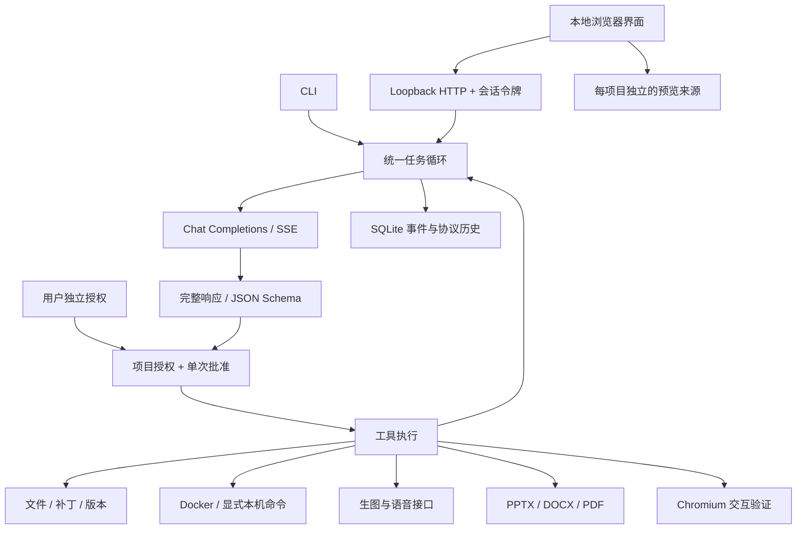

# LebotClaw Harness v0.2 技术实现

本地服务提供浏览器界面；一个 Runtime 负责所有任务执行。用户的官方 Key、第三方兼容接口 Key 和 LebotAPI Key 均经过同一模型边界。超级小博是系统角色，不是独立产品层。

## 执行与授权

`runtime.py` 解析模型、获取项目写锁、冻结执行环境，循环调用模型。参数必须完整，截断输出不执行。每项操作先记意图，再经过 `ToolRegistry.execute` 的参数校验和 `Permissions.check`，然后才调用 handler。即使恶意模型返回未暴露工具的请求，后端仍拒绝。

`permissions.py` 用项目绝对路径索引授权。记住的授权存 SQLite `grants`；临时授权只在内存。默认 Plan 无读取权；写/命令/生图的显式授权蕴含必要项目读取权。新建空项目是用户创建任务的行为，不授予模型读写权。

逐项批准绑定随机 ID、会话、运行和完整参数；待批准 Future 在统一事件循环等待。拒绝回填工具错误。切换授权先停止当前运行，取消待批准 Future；旧卡不能复用。批准模式不能扩大路径范围或取消预算。

自动模式允许常规写文件、Office 生成、浏览器验证和已授权 Docker 命令；生图及未隔离本机命令逐项批准。本机权限宽于项目目录，在授权界面单独说明并要求确认，不把它宣传为项目沙箱。

## 模型与素材

- `model.py` 组装 SSE 工具参数，保留 `reasoning_content` 与工具 ID。流终止、finish_reason 和 JSON 校验通过后才提交工具。
- `config.py` 保留模型 ID、base URL、声明的视觉能力、输出预算、能力绑定；不写 Key。
- `credentials.py` 可选用系统安全库，按运行目录、配置名称、服务商和基础地址绑定凭据。内存 Key 同样绑定目标；失败不降级明文。
- `media.py` 提供 Images、ASR、TTS 适配。万相使用 DashScope SSE，收到终止/完整图片用量就停止读取，避免等待不结束的连接。图片下载不转发 API Key、不跟随重定向、拒绝已解析为内网的地址；图片解码后保存到项目。
- 一次图像请求可能产出多张。记录原始 usage 和请求计数，不编造价格。上游状态未知时不自动重试。当前没有异步上游任务查询协议，也没有本地权威账本。

文字模型与服务商绑定在同一个会话中；换提供商/型号新建会话，仍可选择同一项目。长上下文超过大小限制会明确停止，当前未实现压缩。

## 成果、预览与验证

`artifacts.py` 在临时文件写完后原子替换；覆盖检查 SHA-256，备份保存 `.bin` 原文与 `.json` 路径清单。协作冲突检查不防拥有同一系统账号的恶意进程竞态。

`preview.py` 为生成作品提供独立 HTTP 来源。网页使用相对资源，支持 JS/CSS/图片与 localStorage，不能向外网请求、提交表单或嵌套 frame；不提供主应用令牌或模型 Key。每个项目使用不同端口，重启复用记录端口。端口被其他程序占用时提示释放，不悄悄换源而丢失浏览器数据。

`browser_check` 启动临时隔离 Chromium 上下文，只放行测试项目来源，可 click/fill/press/assert text，收集脚本错误、HTTP 资源错误、截图与成功交互。测试上下文不与用户正在使用的作品共用 localStorage。页面能加载不代表所有业务正确，验证结果只覆盖实际执行的断言。

`documents.py` 使用 python-pptx/python-docx 生成可编辑正文与图片，支持提取 Office 文本。PPT 输出目前是标准内容布局；没有 Office 渲染检查时显式标记 `visual_check=not_performed`。

## 记录、预算和恢复

| 存储 | 用途 |
| --- | --- |
| `config.json` | 非秘密模型配置、能力绑定和工具环境 |
| `sessions.sqlite3` | 会话、运行、消息、事件、工具操作、持久授权 |
| `workspaces/<id>` 或用户目录 | 源码、图片、Office 文档与验证截图 |
| `versions/<run-id>` | 文件覆盖前的内容与路径清单 |
| `preview-ports.json` | 每项目稳定的浏览器存储来源 |
| 系统凭据库 | 用户选择安全保存的 Key |

运行状态为 queued/running/completed/incomplete/failed/cancelled；重启把未完成运行标记 interrupted。未配对 tool call 补入结果未知的消息，不自动重放副作用。批准等待保留 running 状态，运行写锁始终有效。

逐轮统计 token；上游未返回 usage 时保守估算并记录。预算是在发起下一次调用前检查，不能阻止最后一次回复使累计超限。步数、时间、生图请求次数也有上限。乐豆 Key 额度必须由 LebotAPI 服务端权威限制。

CLI 与 Web 共用数据目录进程锁；同一运行器在同一项目只运行一个任务。多个独立运行目录不提供跨进程项目锁。正常停止清理命令进程组；SIGKILL、掉电及主动逃逸的恶意进程不由当前版本保证清理。

## 实现参考

- [DeepSeek Harness](https://github.com/deepseek-ai/deepseek-harness)：本地服务加浏览器界面的参考产品。
- [Images API](https://developers.openai.com/api/reference/resources/images)、[Audio API](https://developers.openai.com/api/reference/resources/audio)：通用兼容协议。
- [Playwright Page](https://playwright.dev/python/docs/api/class-page)：页面交互与截图。
- [python-pptx](https://python-pptx.readthedocs.io/en/latest/user/quickstart.html)：可编辑幻灯片。

万相智云 SSE 适配依据本机已经实测的接口记录；只有这条路径声称适配该协议，不把所有国内图片模型视为同一种请求格式。
